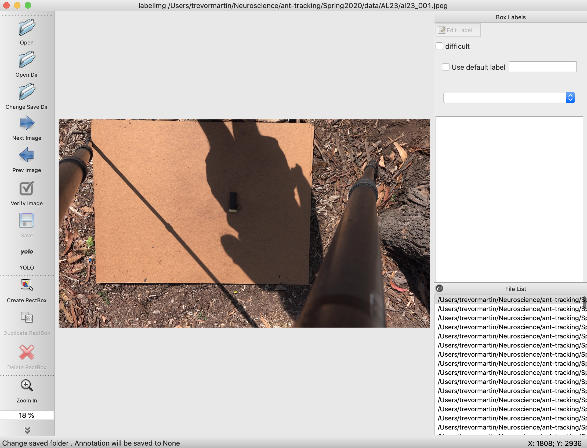
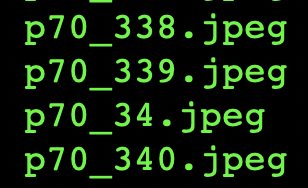

<!-- ---
title: NSCI607-06
author: Trevor Martin's Notes
date: Feb. 01 - Feb. 07, 2021
geometry: margin=3cm
header-includes: |
		 \usepackage{fancyhdr}
		 \pagestyle{fancy}
		 \usepackage{mathrsfs}
		 \usepackage{amssymb}
		 \usepackage{amsmath}
output: pdf_document
--- -->
<!-- &nbsp;&nbsp;  -->

<!-- <script type="text/x-mathjax-config"> MathJax.Hub.Config({tex2jax: { inlineMath:[['$','$'], ['\\(','\\)']],processEscapes: true},jax: ["input/TeX","input/MathML","input/AsciiMath","output/CommonHTML"],extensions: ["tex2jax.js","mml2jax.js","asciimath2jax.js","MathMenu.js","MathZoom.js","AssistieMML.js", "[Contrib]/a11y/accessibility-menu.js"],TeX: {extensions: ["AMSmath.js","AMSsymbols.js","noErrors.js","noUndefined.js"],equationNumbers: {autoNumber: "AMS"}}});</script> -->

## Notes from Last Time
I only filled out a partial progress report for the week before this last week and decided not to finish it in the interest of time. The results from that week will be
absorbed into this report.  

## Overview
During the third week of the spring semester for NSCI607-06, my plan was primarily to begin making use of the new videos uploaded to the Google Drive. Additionally, I verified that the output of YOLOv3 for the bull ant videos already in my possession was good not just by chance by retraining YOLOv3 on them from scratch.

## Goals
- Generally  
1. Create a clean interface for ant researchers to extract ant path data from their videos of ants.
2. Use object detection to detect the paths ants take accurately.
3. Learn more about the intricacies of the $wx$ package in Python.
4. Learn more about OpenCV and object detection.
5. Gain skills in building decently complex things.
- More Specific
1. Explore alternate methods of object tracking.


## Current State

1. I have re-familiarized myself with the process of training YOLOv3.
2. There have been no updates to the Colab files.
3. Some bull ant videos still need to be labeled.
4. I have added a commands.txt file detailing the ffmpeg arguments to convert a video to images.
5. I have programmed a Python script to rename the images in each video dataset directory.

## TODO

1. Retrain YOLOv3 on a variety of ant videos and apply detection on a variety of ant videos.
2. Extract the path of the ants (probably via the bounding box) in each video.
3. Transition to YOLOv4 (this might not be necessary).
4. Make the detection more robust (no lapsing out of bounding box).
5. Create the GUI for the ant detection.
6. Create a tutorial on the training process works with YOLOv3.
7. Experiment with other methods for ant path extraction.

## Future Directions

1. A CNN trained on images with or without ants to detect the position of the ant. Next, one would index the images and plot the sequence of predictions, telling the network the prediction is wrong if it is beyond a certain distance away from the last prediction. There could be a head direction and body location for each image.
2. Perhaps a website may be a better platform for uploading ant videos than a GUI would be.

## Labeling Images

What the labeling tool interface looks like.

{ style="width: 70%; margin: auto;" }


## Renaming Images

```Python
import os
import subprocess

ROOT = os.getcwd()+'/data/'

image_dirs = [d for r, d, f in os.walk(ROOT)][0]
file_by_dir = [os.listdir(ROOT+d) for d in image_dirs]

for dir_index, image_dir in enumerate(image_dirs):
    try:
        largest_num = max([len(f.split('_')[1].split('.')[0]) for f in file_by_dir[dir_index]])
        for f in file_by_dir[dir_index]:
            opath = ROOT+image_dir+'/'+f
            name = f.split('_')[0]
            ext = f.split('.')[1]
            number = f.split('_')[1].split('.')[0]
            if len(number) <= largest_num:
                to_add = largest_num - len(number)
                number = ('0'*to_add)+number
            f_name = name+'_'+number+'.'+ext
            npath = ROOT+image_dir+'/'+f_name
            subprocess.run(['mv', f'{opath}', f'{npath}'])
    except IndexError:
        pass
```

The problem this program solves
{ style="width: 70%; margin: auto;" }
