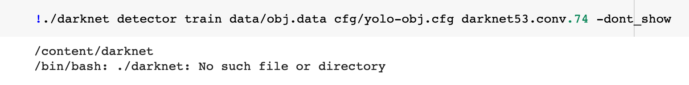

<!-- ---
title: NSCI607-06
author: Trevor Martin's Notes
date: Feb. 0 - Mar. 02, 2021
geometry: margin=3cm
header-includes: |
		 \usepackage{fancyhdr}
		 \pagestyle{fancy}
		 \usepackage{mathrsfs}
		 \usepackage{amssymb}
		 \usepackage{amsmath}
output: pdf_document
--- -->
<!-- &nbsp;&nbsp;  -->

<!-- <script type="text/x-mathjax-config"> MathJax.Hub.Config({tex2jax: { inlineMath:[['$','$'], ['\\(','\\)']],processEscapes: true},jax: ["input/TeX","input/MathML","input/AsciiMath","output/CommonHTML"],extensions: ["tex2jax.js","mml2jax.js","asciimath2jax.js","MathMenu.js","MathZoom.js","AssistieMML.js", "[Contrib]/a11y/accessibility-menu.js"],TeX: {extensions: ["AMSmath.js","AMSsymbols.js","noErrors.js","noUndefined.js"],equationNumbers: {autoNumber: "AMS"}}});</script> -->


## Overview
For the fifth? week of the spring semester for NSCI607-06 I ran into some trouble with
getting YOLOv4 to run with the new data. Additionally, most of my time was spent
"debugging" things to actually get them to work and to diagnose the issues. Since
everything here is quite delicate, e.g. if something is not in the correct folder,
it is generally difficult to have everything run smoothly on the first go. From the
looks of it, the code I wrote worked and then just suddenly stopped working. I need
to figure out what is going on.

## Updates and Current State

1. The ant videos are labelled.
2. I have created several helper programs to assist with YOLOv3 setup.
3. I ran into errors with the execution program and haven't diagnosed the issue.
4. I wrote a brief sequence of steps in here for YOLOv3 setup

## By Next Week

1. I really, really want to this error to go away.
2. Once I train YOLOv3 on all the videos, I will analyze the performance.
3. I want to look into improving the object detection to avoid the previous "shadow video" pitfall.


## Sequence of YOLOv3 Steps
1. Change "save dir" to "obj" in LabelImg
2. Label the images, then rename classes.txt to obj.names
3. Create obj.data in data folder, and move obj.names to data folder
4. Copy whichever images were labeled into the obj folder
5. Make sure that the labels in obj are correct
6. Create yolo-cfg in the cfg folders and change conv.'s and filters to match your classes
7. Create a train and test file in the data folder for the images
8. Make sure the "53" weights are in the darknet folder

## The Annoying Error



## Correcting Labeling Errors

```Python
import os
import csv
import subprocess

ROOT = os.getcwd()+'/05FrameData/x41/'

os.chdir(ROOT)

for f in os.listdir(ROOT):
    lines = []
    name = f
    with open(f, 'r') as _f:
        lines.extend(_f.readlines())
        lines = [elt.replace('\n', '').split() for elt in lines]
        for line in lines:
            if line[0] == '2':
                line[0] = '0'
            if line[0] == '3':
                line[0] = '1'
        lines = [' '.join(elt) for elt in lines]
        subprocess.run(['rm', f'{ROOT+f}'])
    print(lines)
    with open(name, 'w') as _h:
        if len(lines) == 1:
            _h.write(lines[0])
        else:
            _h.write(lines[0])
            _h.write('\n')
            _h.write(lines[1])
        _h.close()
```


## Creating Train/Test Splits

```Python
import glob
import random

txt_files = glob.glob('obj/*.jpg')
files= glob.glob('obj/*.txt')

random.shuffle(txt_files)
trn_files = txt_files[:round(len(txt_files)*0.8)]
tst_files = txt_files[round(len(txt_files)*0.8):]

with open('train.txt', 'w') as file1:
    for f in trn_files:
        if f != trn_files[-1]:
            file1.writelines('data/'+f+'\n')
        else:
            file1.writelines('data/'+f)
    file1.close()

with open('test.txt', 'w') as file2:
    for f in tst_files:
        if f != tst_files[-1]:
            file2.writelines('data/'+f+'\n')
        else:
            file2.writelines('data/'+f)
    file2.close()
```

## Renaming Images v2

```Python
import os
import csv
import subprocess

ROOT = os.getcwd()+'/05FrameData/obj/'

os.chdir(ROOT)

for f in os.listdir(ROOT):
    if ' copy' in f:
        x = f.replace(' copy', '')
        subprocess.run(['mv',f,x])
```

## TODO (unchanged)

1. Retrain YOLOv3 on a variety of ant videos and apply detection on a variety of ant videos.
2. Extract the path of the ants (probably via the bounding box) in each video.
3. Transition to YOLOv4 (this might not be necessary).
4. Make the detection more robust (no lapsing out of bounding box).
5. Create the GUI for the ant detection.
6. Create a tutorial on the training process works with YOLOv3.
7. Experiment with other methods for ant path extraction.

## Goals (unchanged)
- Generally  
1. Create a clean interface for ant researchers to extract ant path data from their videos of ants.
2. Use object detection to detect the paths ants take accurately.
3. Learn more about the intricacies of the $wx$ package in Python.
4. Learn more about OpenCV and object detection.
5. Gain skills in building decently complex things.
- More Specific
1. Explore alternate methods of object tracking.

## Future Directions (unchanged)

1. A CNN trained on images with or without ants to detect the position of the ant. Next, one would index the images and plot the sequence of predictions, telling the network the prediction is wrong if it is beyond a certain distance away from the last prediction. There could be a head direction and body location for each image.
2. Perhaps a website may be a better platform for uploading ant videos than a GUI would be.
