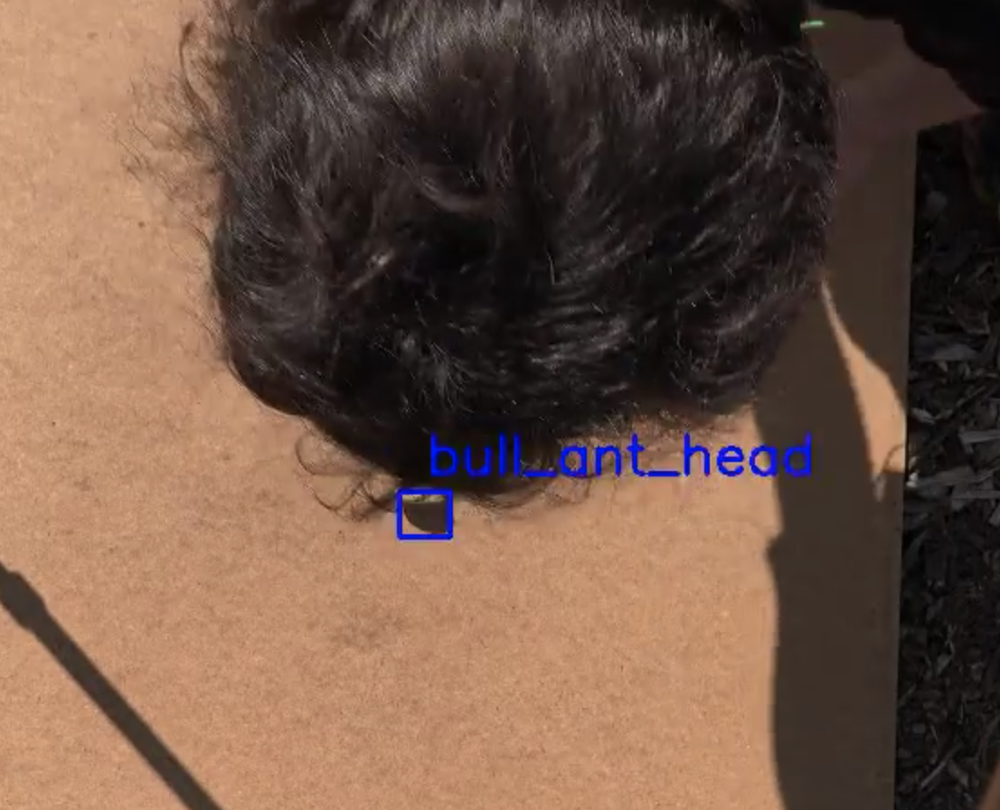
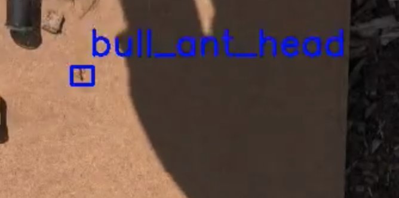
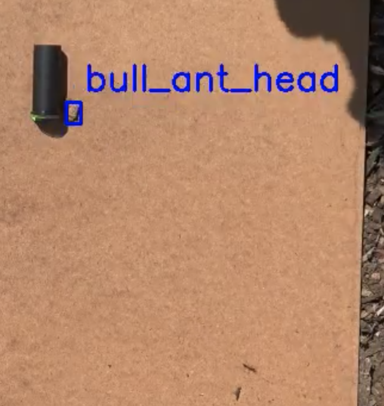

<!-- ---
title: NSCI607-06
author: Trevor Martin's Notes
date: Feb. 0 - Mar. 02, 2021
geometry: margin=3cm
header-includes: |
		 \usepackage{fancyhdr}
		 \pagestyle{fancy}
		 \usepackage{mathrsfs}
		 \usepackage{amssymb}
		 \usepackage{amsmath}
output: pdf_document
--- -->
<!-- &nbsp;&nbsp;  -->

<!--  -->

## Overview
For the eighth week of the spring semester for NSCI607-06 I spent the enter week training and
testing subsets of the labeled data. In particular, I would train Darknet on 3-4 videos and then
test it on the remaining videos to see how well it generalized. Doing this is important because if any
researcher is going to upload their own style of videos that have not been incorporated into
the detection pipeline, it is useful to know how many videos and what type of videos they'll
have to upload to get the results they want. While I have yet to train Darknet on all the
videos at once, there are several problems I ran into across the videos I did test.

In the lower quadrant
Next to the bin
Head is not really detected
In one of the videos I must have labeled the body as head

## Updates and Current State

1. Have a collection of trained weights.
2. Have a collection of programming problems to fix.

## By Next Week

1. Fix several of the issues listed below.
3. Train the network on all the videos.

## Problem 01 - Ant in the Hair

There was one video where the ant was visible between the hair and labeled. These
several images seem to have been weighted a lot and result in the detection of an
ant in the hair. This is probably solvable by not labeling the ant in videos when
they are not _directly_ visable

## Problem 02 - Ant Head != Body

The ant's body and head are often mis-detected. This might be the result of three things:
(1) the first is that head is simply too small in these videos to detect, (2) I may have accidentally
altered (via code) the labels for head and body for some images, and (3) there may be
insufficient training data in using just a subset of these videos. I think it is really a blend of
these issues. For (1), I think that this issue is indicative of the fact that the head is
probably not able to be detected and that not labeling the head may improve performance of body
labeling. What are your thoughts on this? Could people still manually check if the head moves at
a given point but have the body path automatically extracted? For (2), I just need to check the
labeling and possible relabeled some portions of a video. For (3), we will see how training
on all videos improves performance.

## Problem 03 - The Pill Bottle

The ant snuck under the pill bottle in one of the videos and I labeled it as such. This caused
the network to identify the _edge_ of the pill bottle in several cases as being an ant. This
should go away with more training data but if not it might be necessary to only label the ant
when it is in the open.

## Problem 04 - Clustered Points

I am not sure exactly how I could fix this programmatically, but I know theoretically it can be
fixed with programming. The issue is that a cluster of points have been labeled when we know that
there should only be a single ant in each frame of the video. To fix this I am considering, in addition
to working on Darknet, setting up another network that uses the position files and the video.together.

## TODO (unchanged)

1. COMPLETE
2. Extract the path of the ants (probably via the bounding box) in each video.
3. Transition to YOLOv4 (this might not be necessary).
4. Make the detection more robust (no lapsing out of bounding box).
5. Create the GUI for the ant detection.
6. Create a tutorial on the training process works with YOLOv3.
7. Experiment with other methods for ant path extraction.

## Goals (unchanged)
- Generally  
1. Create a clean interface for ant researchers to extract ant path data from their videos of ants.
2. Use object detection to detect the paths ants take accurately.
3. Learn more about the intricacies of the $wx$ package in Python.
4. Learn more about OpenCV and object detection.
5. Gain skills in building decently complex things.
- More Specific
1. Explore alternate methods of object tracking.

## Future Directions (unchanged)

1. A CNN trained on images with or without ants to detect the position of the ant. Next, one would index the images and plot the sequence of predictions, telling the network the prediction is wrong if it is beyond a certain distance away from the last prediction. There could be a head direction and body location for each image.
2. Perhaps a website may be a better platform for uploading ant videos than a GUI would be.
