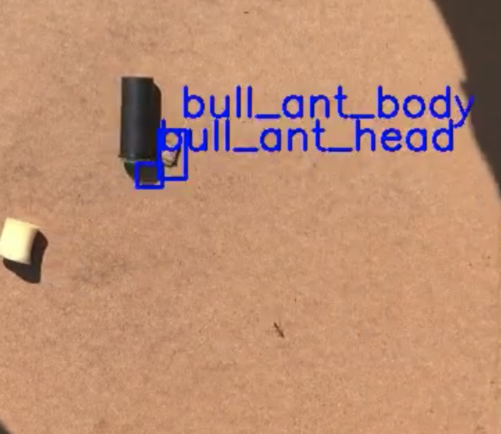

<!-- ---
title: NSCI607-06
author: Trevor Martin's Notes
date: Feb. 0 - Mar. 02, 2021
geometry: margin=3cm
header-includes: |
		 \usepackage{fancyhdr}
		 \pagestyle{fancy}
		 \usepackage{mathrsfs}
		 \usepackage{amssymb}
		 \usepackage{amsmath}
output: pdf_document
--- -->
<!-- &nbsp;&nbsp;  -->

<!--  -->

## Overview
For the ninth week of the spring semester for NSCI607-06 I attempted to ameliorate the detection problems
on the subsets of data I used to find problems with and the limits of the object detector's ability to
pick out ants. There were four notable problems from the week prior. I managed to remove labels near
Zach's head and managed to remove most labels where the ant's body was obstructed by some object, like the
pill bottle. I have, for the most part, removed the head labels. There was one video that I forgot to copy
and save before I ran code on it to remove the head labels, so I ended up having to relabel it. Although I
set out to train YOLO on all videos this week, I unfortunately didn't manage to get to it due to the other
issues eating away at my time, my other coursework, and the fact that training on all videos takes some time
to set up. Nonetheless, I believe during this next week or so I should be able to do it. Oh also, I wasn't
really able to address problem 4 from last week but believe training on all video will probably help.

## Updates and Current State

1. Problem 1-3 are for the most part eliminated.
2. _Still need to train the network on all videos_

## By Next Week

1. Train the network on all the videos!
2. Analyze performance again after (1)
3. Address performance issues.
4. Look into addressing problem (4)

## Problems from last time that were addressed

1. Ant in the Hair
2. Ant Head != Body - this one is done for the most part,
but there are still videos where I have to remove the
ant head labels. I had to relabel of the videos because
I forgot to save the images before I ran code on it to
automatically remove the head labels.
3. The Pill Bottle

## Problem 04 - Clustered Points

I am not sure exactly how I could fix this programmatically, but I know theoretically it can be
fixed with programming. The issue is that a cluster of points have been labeled when we know that
there should only be a single ant in each frame of the video. To fix this I am considering, in addition
to working on Darknet, setting up another network that uses the position files and the video.together.

<!-- ## TODO (unchanged)

1. COMPLETE
2. Extract the path of the ants (probably via the bounding box) in each video.
3. Transition to YOLOv4 (this might not be necessary).
4. Make the detection more robust (no lapsing out of bounding box).
5. Create the GUI for the ant detection.
6. Create a tutorial on the training process works with YOLOv3.
7. Experiment with other methods for ant path extraction.

## Goals (unchanged)
- Generally  
1. Create a clean interface for ant researchers to extract ant path data from their videos of ants.
2. Use object detection to detect the paths ants take accurately.
3. Learn more about the intricacies of the $wx$ package in Python.
4. Learn more about OpenCV and object detection.
5. Gain skills in building decently complex things.
- More Specific
1. Explore alternate methods of object tracking.

## Future Directions (unchanged)

1. A CNN trained on images with or without ants to detect the position of the ant. Next, one would index the images and plot the sequence of predictions, telling the network the prediction is wrong if it is beyond a certain distance away from the last prediction. There could be a head direction and body location for each image.
2. Perhaps a website may be a better platform for uploading ant videos than a GUI would be. -->
