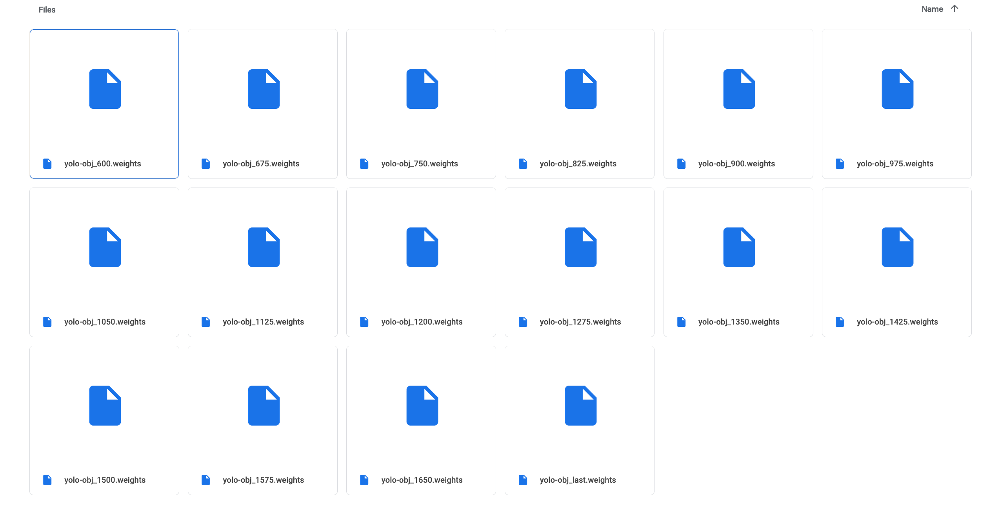

<!-- ---
title: NSCI607-06
author: Trevor Martin's Notes
date: Feb. 0 - Mar. 02, 2021
geometry: margin=3cm
header-includes: |
		 \usepackage{fancyhdr}
		 \pagestyle{fancy}
		 \usepackage{mathrsfs}
		 \usepackage{amssymb}
		 \usepackage{amsmath}
output: pdf_document
--- -->
<!-- &nbsp;&nbsp;  -->

<!-- <script type="text/x-mathjax-config"> MathJax.Hub.Config({tex2jax: { inlineMath:[['$','$'], ['\\(','\\)']],processEscapes: true},jax: ["input/TeX","input/MathML","input/AsciiMath","output/CommonHTML"],extensions: ["tex2jax.js","mml2jax.js","asciimath2jax.js","MathMenu.js","MathZoom.js","AssistieMML.js", "[Contrib]/a11y/accessibility-menu.js"],TeX: {extensions: ["AMSmath.js","AMSsymbols.js","noErrors.js","noUndefined.js"],equationNumbers: {autoNumber: "AMS"}}});</script> -->


## Overview

NSCI607-06: This week I trained YOLOv3 completely on the videos I had available to me. This consisted of uploading several documents to my Google account and sharing them with my other
Google accounts when I ran out of training time. I then let Colab train and after five hours
of training, or whenever it stopped, I would begin training anew using the last saved
weights. Each of these iterations takes some time and there is no real end except for the
performance of the weights in detecting ants. Midway through the week I tested the performance
and found that on some videos the ants were classified _decently_ but in other, short videos
such as __AL23__, the ant wasn't classified at all! I think this is due to the amount of
training data; overall, there aren't too many usable images in the dataset (this is speaking
relative to how YOLOv3 is typically trained). So, I asked for more training videos and have
been labeling them with the goal of feeding them all into the dataset. Another idea is that
a parameter I changed called ```steps``` might have been better left unchanged. This parameter
governs how many iterations the network 'scans' over an image in a given batch. I decreased
it due to the size of the dataset but think it might be a good idea to increase it back to
where it was. Decreasing it makes the network faster but in this case I think I sacrificed
some accuracy.

## Updates and Current State

1. Retraining to get better performance.
2. This should be the forecast until semester ends; it should be good by then.

## By Next Week

1. Keep doing what I am doing. If more videos could be uploaded that'd be great.


<!--  -->

## TODO 

COMPLETED
1. Trained on all videos.
2. Created a tutorial on the training process works with YOLOv3.

UNCOMPLETED
1. Make the detection more robust (no lapsing out of bounding box).
2. Extract ant paths.

<!-- ## Goals (unchanged)
- Generally  
1. Create a clean interface for ant researchers to extract ant path data from their videos of ants.
2. Use object detection to detect the paths ants take accurately.
3. Learn more about the intricacies of the $wx$ package in Python.
4. Learn more about OpenCV and object detection.
5. Gain skills in building decently complex things.
- More Specific
1. Explore alternate methods of object tracking.

## Future Directions (unchanged)

1. A CNN trained on images with or without ants to detect the position of the ant. Next, one would index the images and plot the sequence of predictions, telling the network the prediction is wrong if it is beyond a certain distance away from the last prediction. There could be a head direction and body location for each image.
2. Perhaps a website may be a better platform for uploading ant videos than a GUI would be. -->
