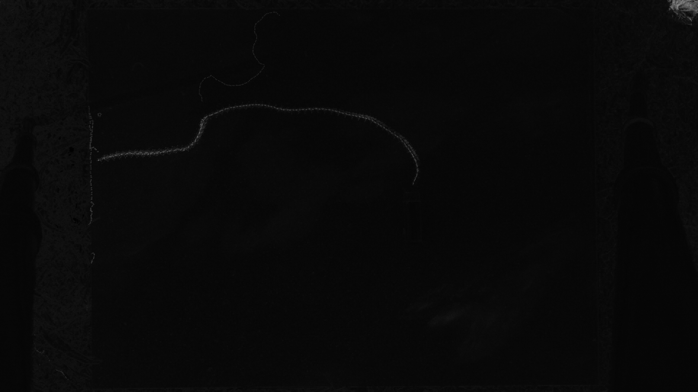
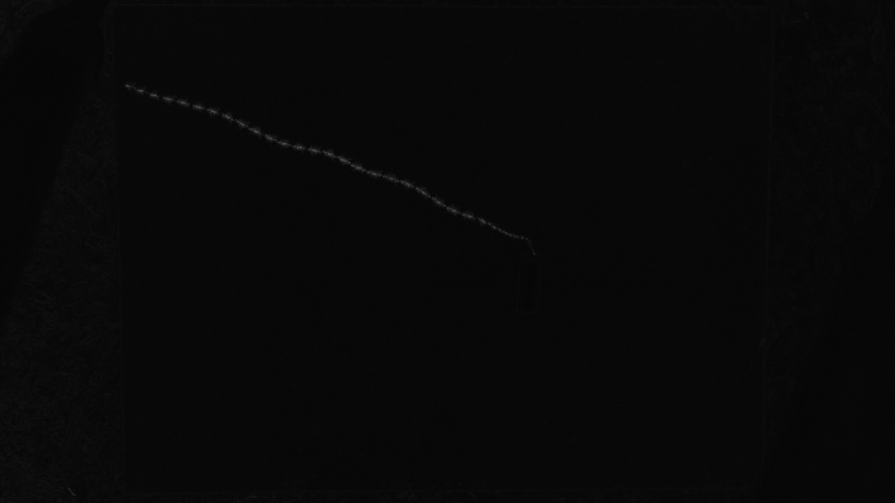
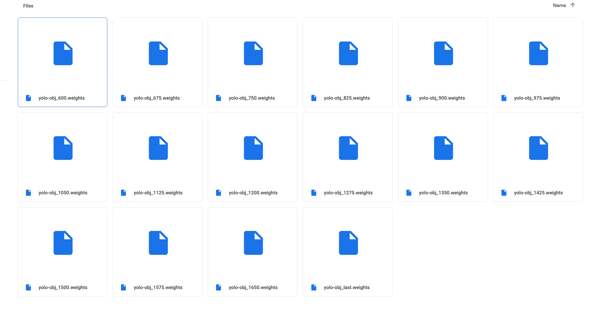

<!-- ---
title: NSCI607-06
author: Trevor Martin's Notes
date: Feb. 0 - Mar. 02, 2021
geometry: margin=3cm
header-includes: |
		 \usepackage{fancyhdr}
		 \pagestyle{fancy}
		 \usepackage{mathrsfs}
		 \usepackage{amssymb}
		 \usepackage{amsmath}
output: pdf_document
--- -->
<!-- &nbsp;&nbsp;  -->

<!-- <script type="text/x-mathjax-config"> MathJax.Hub.Config({tex2jax: { inlineMath:[['$','$'], ['\\(','\\)']],processEscapes: true},jax: ["input/TeX","input/MathML","input/AsciiMath","output/CommonHTML"],extensions: ["tex2jax.js","mml2jax.js","asciimath2jax.js","MathMenu.js","MathZoom.js","AssistieMML.js", "[Contrib]/a11y/accessibility-menu.js"],TeX: {extensions: ["AMSmath.js","AMSsymbols.js","noErrors.js","noUndefined.js"],equationNumbers: {autoNumber: "AMS"}}});</script> -->


## Overview

NSCI607-06: I retrained and edited the parameters of the ```cfg``` (configuration) files and added
all new videos to the mix. Given the low performance on a non-trivial amount of tests, I opted to
spend some time experimenting with alternate approaches. After a few hours, I got one of them to
work surprisingly well. The end result if that for each cropped video, the ant's full path is
fully highlighted. All that remains to be done is to extract this path and generate a position
file. The problem with this is that in some cases, people and other smaller ants are highlighted
in the image. To solve this issue, I am considering have the user draw over the correct path or
select the correct path with a number after all regions of white are labeled.

## Updates and Current State

1. Reformulated problem
2. Awaiting approval and fixes

## Images of the New Approach







## Some Code of the New Approach

```Python
import subprocess
import os
import glob
import math

ROOT = os.getcwd()+'/'+'overlay_test/'
files = glob.glob(ROOT+'*.jpg')
cmdsa1 = ['compare']
cmdsb1 = ['convert', '-density','300']
cmdsc1 = ['compare','-density','300','-metric', 'AE', '-fuzz', '4%']
other = []
for f in sorted(files)[2:4]:
    other.append(f)
cmdsa2 = ['-compose', 'Src', '-highlight-color', 'White', '-lowlight-color', 'Black', 'result.jpg']
cmdsb2 = ['-compose','difference','-composite','-colorspace','Gray', 'result.jpg']
cmdsc2 = ['-compose','src','result.jpg']
total = cmdsb1+other+cmdsb2
subprocess.run(total)

ROOT = os.getcwd()+'/'+'c0128/'
files = sorted(glob.glob(ROOT+'*.jpeg'))

cmdsb1 = ['convert', '-density','300']

if len(files) % 2 != 0:
    files = files[:-1]

for index in range(0, len(files), 2):
    cmdsb2 = ['-compose','difference','-composite','-colorspace','Gray']
    total = []
    if index < 10:
        name = 'result00'+f'{index}'+'.jpeg'
        cmdsb2.append(name)
    elif 10 <= index < 100:
        name = 'result0'+f'{index}'+'.jpeg'
        cmdsb2.append(name)
    else:
        name = 'result'+f'{index}'+'.jpeg'
        cmdsb2.append(name)
    try:
        total = cmdsb1 + [files[index], files[index+1]] + cmdsb2
    except IndexError:
        pass
    subprocess.run(total)

# get video name
# name directory with name
# make save directory for all final outputs and converted positions
# ask if you want to delete all the intermediate images

if os.path.isdir('overlay_output') != True:
    subprocess.run(['mkdir','overlay_output'])

files = sorted(glob.glob('*.jpeg'))
cmdsd1 = ['convert', '-compose','lighten', files[0]]
other = []
name = 'c0128.jpeg'
for f in sorted(files)[1:]:
    other.append(f)
    other.append('-composite')
other.append('c0128.jpeg')
total = cmdsd1+other
subprocess.run(total)
```

## By May 11th? (Select final due date)

1. TODO

<!--  -->

## TODO

1. ?Make drawing tool
2. ?Package into Colab w/ instructions incl. pictures of what not to include
3. ?Have you test it for usability.

<!-- ## Goals (unchanged)
- Generally  
1. Create a clean interface for ant researchers to extract ant path data from their videos of ants.
2. Use object detection to detect the paths ants take accurately.
3. Learn more about the intricacies of the $wx$ package in Python.
4. Learn more about OpenCV and object detection.
5. Gain skills in building decently complex things.
- More Specific
1. Explore alternate methods of object tracking.

## Future Directions (unchanged)

1. A CNN trained on images with or without ants to detect the position of the ant. Next, one would index the images and plot the sequence of predictions, telling the network the prediction is wrong if it is beyond a certain distance away from the last prediction. There could be a head direction and body location for each image.
2. Perhaps a website may be a better platform for uploading ant videos than a GUI would be. -->
